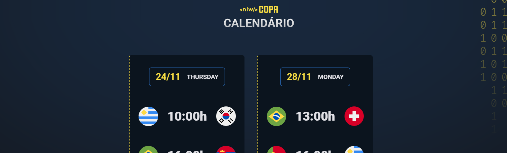

<h1 align="center">🧑‍💻⚽NLW - COPA<h1>

O desafio do projeto é desenvolver um calendário de jogos da Copa do Mundo aplicando elementos, cores, texturas...

  

## 🚀 Tecnologias Utilizadas
- HTML
- CSS
- JavaScript
- Git
- Github

## 🔍 Layout
Você pode visualizar o layout do projeto através [DESSE LINK](https://www.figma.com/file/FnXXh7zGhLXCn8tXzsVqdM/Calend%C3%A1rio-de-Jogos-(Community)?node-id=175%3A1815). É necessário ter conta no [FIGMA](https://www.figma.com/) para acessá-lo.